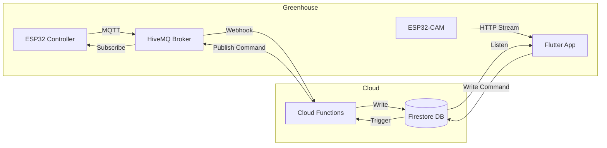

# 🌿 Greenhouse Tender

[](https://flutter.dev)
[](https://firebase.google.com)
[](https://www.espressif.com/)
[](LICENSE)
[]()

> **A professional, cloud-connected ecosystem for precision greenhouse management.**

**Greenhouse Tender** is a robust IoT solution designed to monitor and control your greenhouse environment in real-time. By bridging low-level hardware sensors with a high-performance Flutter mobile application via Firebase, it provides a seamless, "mission-control" experience for the modern gardener.

---

## 🚀 Key Features

### 📱 **Modern Mobile Dashboard**
- **Dark Mode UI**: A sleek, battery-friendly interface designed for high contrast and readability.
- **Real-Time Data**: Instant updates for **Temperature**, **Humidity**, **Soil Moisture**, and **pH** levels using Firestore real-time listeners.
- **Visual Health Indicators**: Cards change color (Green/Red) dynamically based on user-defined safety thresholds.

### 🎮 **Interactive Control Center**
- **Bi-Directional Control**: Toggle **Fans**, **Vents**, and **Heaters** directly from the app.
- **State Feedback**: Buttons glow green only when the device confirms it is active, ensuring true state synchronization.
- **Live Video Feed**: Integrated low-latency video streaming from an ESP32-CAM to keep an eye on your plants from anywhere.

### ⚡ **Robust Backend Architecture**
- **Data Aggregation**: Cloud Functions merge incoming MQTT sensor streams into a single "latest status" document to prevent UI flickering.
- **Smart Alerts**: Automated Firebase Cloud Messaging (FCM) push notifications when environmental conditions drift out of safe ranges.
- **History Logging**: Separate scalable storage for historical sensor data to support future analytics.

---

## 🏗️ System Architecture

The system follows a reactive, event-driven architecture:



---

## 🛠️ Technology Stack

### **Hardware**
*   **Microcontroller**: ESP32 DevKit V1
*   **Video**: ESP32-CAM (AI-Thinker)
*   **Sensors**: DHT22 (Temp/Hum), Capacitive Soil Moisture, Analog pH Sensor (SEN0161), DS18B20 (Probe)
*   **Actuators**: 4-Channel 5V Relay Module

### **Firmware**
*   **Language**: C++
*   **Framework**: Arduino / PlatformIO
*   **Libraries**: `PubSubClient` (MQTT), `Adafruit_SSD1306` (OLED), `DHT`

### **Backend**
*   **Runtime**: Node.js (Firebase Cloud Functions)
*   **Database**: Google Cloud Firestore (NoSQL)
*   **Messaging**: HiveMQ (MQTT Broker) + Firebase Cloud Messaging (FCM)

### **Mobile App**
*   **Framework**: Flutter (Dart)
*   **Dependencies**: `cloud_firestore`, `flutter_vlc_player`, `fl_chart`, `google_fonts`, `font_awesome_flutter`

---

## 📂 Project Structure

```bash
greenhouse-monitoring/
├── esp32-firmware/         # C++ firmware for sensor reading & relay control
├── esp32-cam-firmware/     # C++ firmware for video streaming server
├── cloud-functions/        # Node.js backend logic (triggers, aggregation)
├── flutter-app/            # Production-ready mobile application
│   ├── lib/
│   │   ├── widgets/        # Reusable UI components (SensorCard, ControlRow)
│   │   └── main.dart       # Main entry point & dashboard logic
├── docs/                   # Wiring diagrams and datasheets
└── README.md               # Project documentation
```

---

## ⚡ Getting Started

### 1. Firmware Setup
1.  Open `esp32-firmware` in **VS Code** with the **PlatformIO** extension.
2.  Rename `include/config.example.h` to `include/config.h` and add your WiFi/MQTT credentials.
3.  Build and Upload to your ESP32.
4.  Repeat for `esp32-cam-firmware`.

### 2. Backend Deployment
1.  Navigate to `cloud-functions`:
    ```bash
    cd cloud-functions
    npm install
    ```
2.  Deploy to Firebase:
    ```bash
    firebase deploy --only functions
    ```

### 3. Mobile App
1.  Navigate to `flutter-app`:
    ```bash
    cd flutter-app
    flutter pub get
    ```
2.  Update the camera IP in `lib/main.dart` (line 60).
3.  Run the app:
    ```bash
    flutter run
    ```

---

## 🤝 Contributing

Contributions are what make the open-source community such an amazing place to learn, inspire, and create. Any contributions you make are **greatly appreciated**.

1.  Fork the Project
2.  Create your Feature Branch (`git checkout -b feature/AmazingFeature`)
3.  Commit your Changes (`git commit -m 'Add some AmazingFeature'`)
4.  Push to the Branch (`git push origin feature/AmazingFeature`)
5.  Open a Pull Request

---

## 📄 License

Distributed under the MIT License. See `LICENSE` for more information.

---

## 📞 Contact

**Pat Ryan** - [GitHub Profile](https://github.com/secretengineer)

Project Link: [https://github.com/secretengineer/Greenhouse-Tender-2](https://github.com/secretengineer/Greenhouse-Tender-2)
